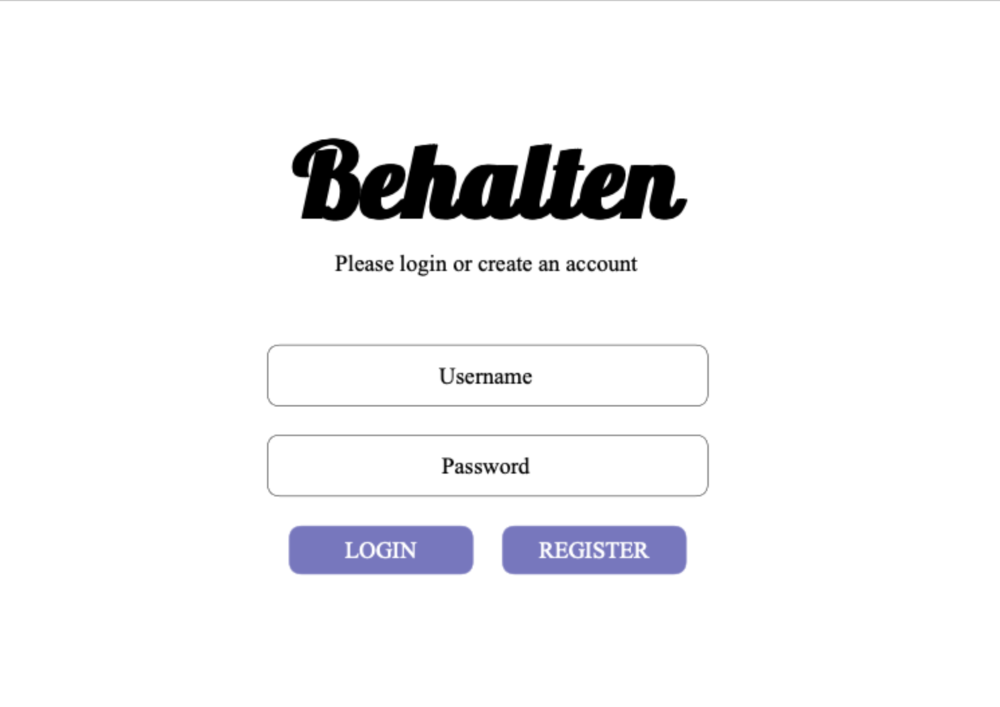
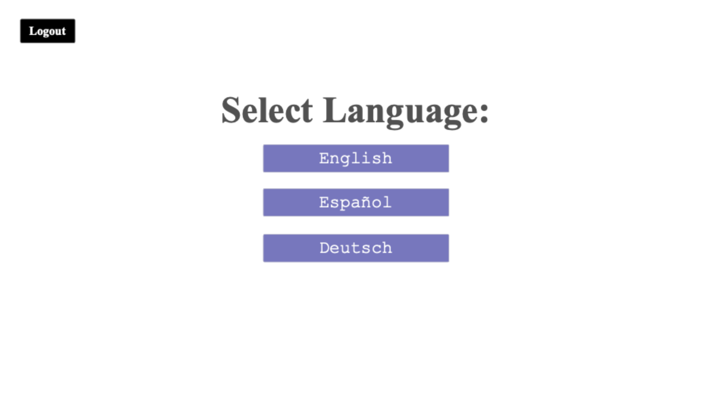
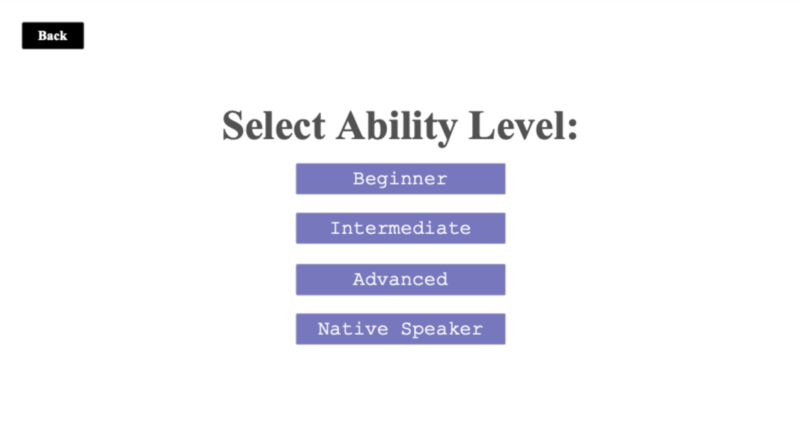
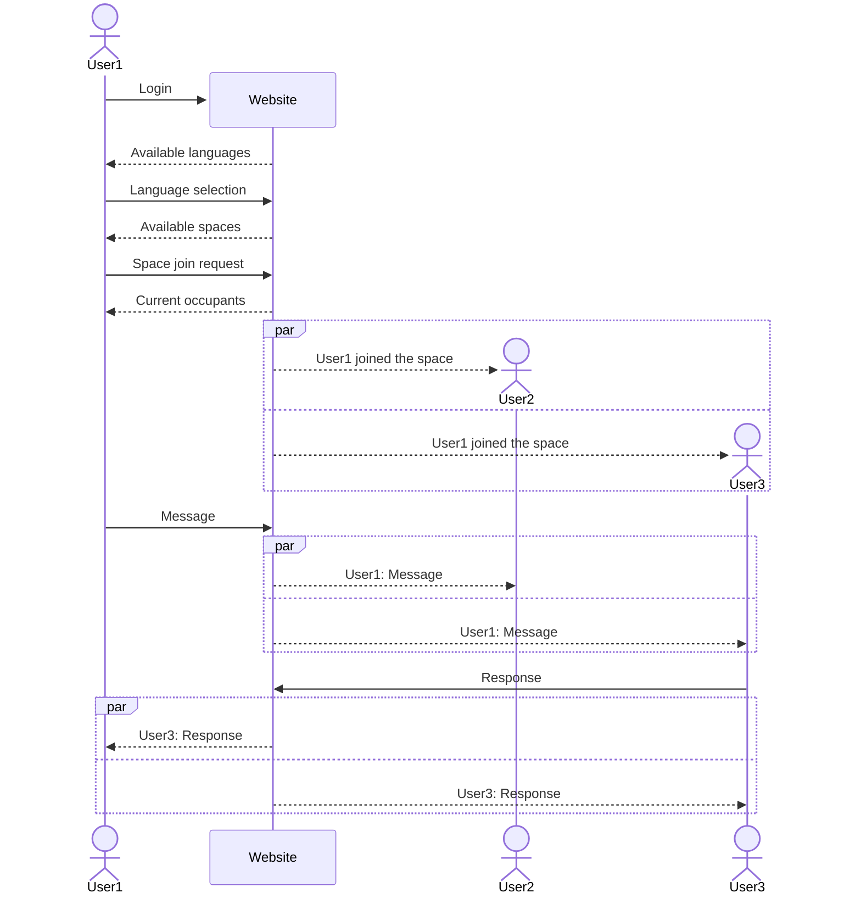

# Behalten

[My Notes](notes.md)

_Behalten_ is a web-based application intended to assist users in maintaining or expanding their foreign language skills. It allows users to interact with others who are learning or who speak the same language as them, leading to preservation of their skills and growth in their abilities.

## 🚀 Specification Deliverable

For this deliverable I did the following (I checked the box `[x]` and added a description for the things I completed):

- [x] **Proper use of Markdown** - I used Markdown properly
- [x] **A concise and compelling elevator pitch** - I added an [elevator pitch](#elevator-pitch)
- [x] **Description of key features** - I described the [key features](#key-features)
- [x] **Description of how you will use each technology** - I planned out and described my use of each [technology](#technologies)
- [x] **One or more rough sketches of your application. Images must be embedded in this file using Markdown image references.** - I added sketches of my application [design](#design) using Markdown image references

### Elevator pitch

Have you ever spent time studying a foreign language only to remember none of it a short time later? Have you moved away from home and no longer have opportunities to speak your native language? _Behalten_ is an application designed to help users maintain their language skills. Users can connect with others of their skill level and practice together in a natural conversation setting.

### Design

This is a tentative mock up for the design of the login page:

The language selection page:

The space/ability level selection page:

The space page where the user can interact with others and chat in the target language:

This is a simplified sequence diagram showing the idea of how the various clients will interact with the website:

### Key features

- Secure login
- Ability to select language and ability level
- Ability to select user with whom to message
- Ability to hold a conversation message stream with other users
- Ability to define English words

### Technologies

The required technologies will be implemented to provide the following:

- **HTML** - HTML structure to build 4 pages. One for login, one for language selection, one for space (ability level) selection, and one for the actual conversation space. 
- **CSS** - Styling to appear visually appealing on various sizes of screens, including spacing, color palette, and more.
- **React** - Provides login/register and logout, displays language options, displays available spaces, allows the user to select language and space, displays other users, allows the user to open or close a chat, sends messages, returns to a previous page, requests and displays definitions, and uses React for endpoint calls and routing.
- **Service** - Backend with endpoints to:
    - Login, logout, and register a user
    - Join a space
    - Retrieve users in a space
    - Send messages
    - Leave a space
    - Request a definition (using the [Free Dictionary](https://dictionaryapi.dev) API)
- **DB/Login** - Stores user data, stores authentication data, and stores spaces and occupants.
- **WebSocket** - Broadcasts messages to other users in the chat, broadcasts join/leave notifications to other users in the space, and receives definitions.

## 🚀 AWS deliverable

For this deliverable I did the following. I checked the box `[x]` and added a description for things I completed.

- [x] **Server deployed and accessible with custom domain name** - [My server link](https://behalten.click).

## 🚀 HTML deliverable

For this deliverable I did the following. I checked the box `[x]` and added a description for things I completed.

- [x] **HTML pages** - I created four html pages for each part of my application. `index.html` is the landing page and the login page, `language.html` is the page where the user will select their desired conversation language, `level.html` is the page where users will interact with other users.
- [x] **Proper HTML element usage** - I used proper html tags, such as `body`, `main`, `header`, `footer`, and `nav`, among others.
- [x] **Links** - I have a navigation section on every page linking to the other pages and a footer with a link to my GitHub repository.
- [x] **Text** - I added text to clarify what was still to be added at each phase and what was going on.
- [x] **3rd party API placeholder** - I built in a placeholder for where a 3rd party API will help the user define words.
- [x] **Images** - I inserted an image on each page of the Behalten Logo.
- [x] **Login placeholder** - I added a form in html as a placeholder for the login.
- [x] **DB data placeholder** - I added a placeholder for the available user list which will be retrieved from the database.
- [x] **WebSocket placeholder** - I added a placeholder for where the WebSocket will allow users to message each other and receive notifications.

## 🚀 CSS deliverable

For this deliverable I did the following. I checked the box `[x]` and added a description for things I completed.

- [x] **Header, footer, and main content body** - I styled the header, footer, and main content body using CSS and bootstrap. Please note that in order to see my github link, you have to scroll down to the bottom and the window has to be sized large enough.
- [x] **Navigation elements** - I styled the navigation elements to actually look like a navigation bar.
- [x] **Responsive to window resizing** - I used flex in CSS to allow my content to be sensitive to window resizing.
- [x] **Application elements** - I styled my application elements so they don't look quite as bad. I also added more detail to allow for the information to be better displayed, even as it is still nonfunctional.
- [x] **Application text content** - I updated the font and moved my text elements around.
- [x] **Application images** - I styled my logo image to fit in the navigation bar.

## 🚀 React part 1: Routing deliverable

For this deliverable I did the following. I checked the box `[x]` and added a description for things I completed.

- [x] **Bundled using Vite** - I reorganized my files according to what Vite wants and implemented using Vite.
- [x] **Components** - I created various react components and used them to replace my html pages.
- [x] **Router** - I created a router to handle transitions between the various components.

## 🚀 React part 2: Reactivity deliverable

For this deliverable I did the following. I checked the box `[x]` and added a description for things I completed.

- [x] **All functionality implemented or mocked out** - I implemented or mocked out all functionality for my web application. This involved setting up a login, selections for level and language, and mocking out the definitions, user list, and messaging.
- [x] **Hooks** - I used `React.useState()` and `React.useEffect()` within my code.

## 🚀 Service deliverable

For this deliverable I did the following. I checked the box `[x]` and added a description for things I completed.

- [ ] **Node.js/Express HTTP service** - I did not complete this part of the deliverable.
- [ ] **Static middleware for frontend** - I did not complete this part of the deliverable.
- [ ] **Calls to third party endpoints** - I did not complete this part of the deliverable.
- [ ] **Backend service endpoints** - I did not complete this part of the deliverable.
- [ ] **Frontend calls service endpoints** - I did not complete this part of the deliverable.
- [ ] **Supports registration, login, logout, and restricted endpoint** - I did not complete this part of the deliverable.

## 🚀 DB deliverable

For this deliverable I did the following. I checked the box `[x]` and added a description for things I completed.

- [ ] **Stores data in MongoDB** - I did not complete this part of the deliverable.
- [ ] **Stores credentials in MongoDB** - I did not complete this part of the deliverable.

## 🚀 WebSocket deliverable

For this deliverable I did the following. I checked the box `[x]` and added a description for things I completed.

- [ ] **Backend listens for WebSocket connection** - I did not complete this part of the deliverable.
- [ ] **Frontend makes WebSocket connection** - I did not complete this part of the deliverable.
- [ ] **Data sent over WebSocket connection** - I did not complete this part of the deliverable.
- [ ] **WebSocket data displayed** - I did not complete this part of the deliverable.
- [ ] **Application is fully functional** - I did not complete this part of the deliverable.
